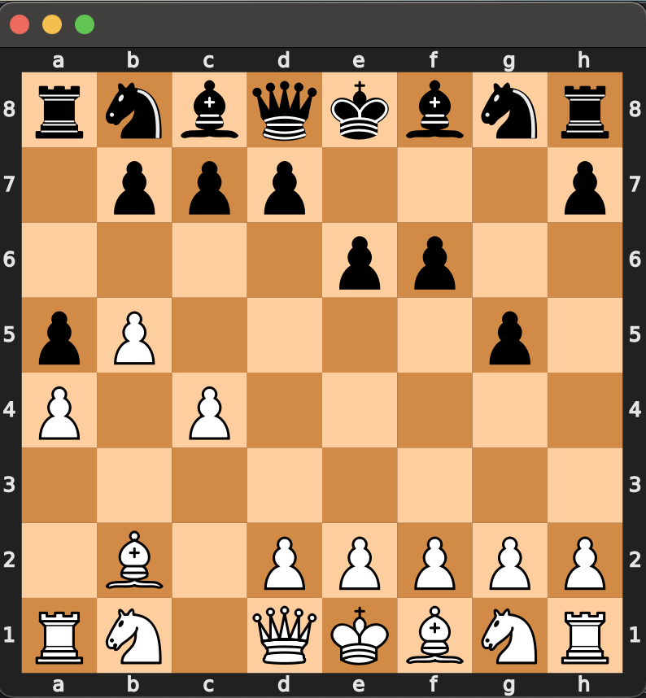
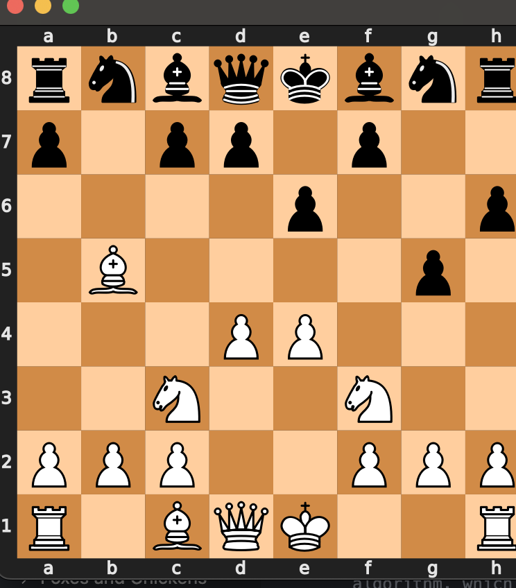

# Chess AI Report

## Introduction: 

Thanks to python's `chess`  library, no time was spent implementing the structure of the game itself. This project focuses on the different strategy approaches I used in the project to design and enhance the chess ai. 

Header comments were removed for anonymity. 

## Evaluation Function

Before writing the algorithms to search the game states, I needed to develop a way to evaluate the board. I began this by using material evaluation, using the values 1, 3, 3, 5, and 9 for the pawn, knight, bishop, rook, and queen respectively.  

I needed to make the kings value higher than all of the others combined, so I just set it to 100. Of course, the evaluation of the board is then calculated by finding the difference in material value on each side. 

The algorithm is pretty simple, and can be found in the file `EvaluateBoard.py`. This function specifically is called `evaluate_board` (not `evaluate_board_modified`). 

The pseudo is as follows: 
```
def evaluate_board(board, team):
    initialize the total value to be 0   
    for each square
    for square in the board:
        get that square's piece
        if there is a piece in the square 
            get the piece's value
            if the piece is on the same team, add the value 
            otherwise, subtract the value
    return the board's total value 
```

**NOTE** 
These functions were originally tested in the `test_chess` file. This allowed me to confirm that the pieces were being tallied correctly. However, since the work in the section below, these test outputs are no longer accurate. 

The section below
### Extra-Credit
Upon running the program many times though, I realized that this lead to a lot of illogical playmaking, so I searched online for some ways to improve the evaluation function. I found a strategy using positional based evaluations: the piece's position on the board is evaluated in addition to it's material value. These positional values are stored in a 2D-Array called a piece-square table. 

I read multiple articles and studies on positional evaluation and found that neural-network position systems have become increasingly popular, but I don't have much experience with that, so I decided to just use these example tables that I found. 

The algorithm looks pretty similar to the evaluation function, but adjusts the value of the piece according to where it is on the board. I found a set of piece-square tables online that would allow me to make these adjustments, and created the separate file `EvaluateBoard.py` to store the tables and separate the functions more easily. The function that uses the piece-square values is called

It took me a bit of time to rearrange all of these tables and adjust the values to ensure that they wouldn't outweight any of the pieces themselves and that their relative weights were accurate. 

This did end up having a massive effect on the strength of my AI's gameplay.

The tables are different for each piece: for example, here are the tables for both the knight and bishop: 
```
knight_table = [
    -50, -40, -30, -30, -30, -30, -40, -50,
    -40, -20, 0, 0, 0, 0, -20, -40,
    -30, 0, 10, 15, 15, 10, 0, -30,
    -30, 5, 15, 20, 20, 15, 5, -30,
    -30, 0, 15, 20, 20, 15, 0, -30,
    -30, 5, 10, 15, 15, 10, 5, -30,
    -40, -20, 0, 5, 5, 0, -20, -40,
    -50, -40, -30, -30, -30, -30, -40, -50
]
```
```
bishop_table = [
    -20, -10, -10, -10, -10, -10, -10, -20,
    -10, 0, 0, 0, 0, 0, 0, -10,
    -10, 0, 5, 10, 10, 5, 0, -10,
    -10, 5, 5, 10, 10, 5, 5, -10,
    -10, 0, 10, 10, 10, 10, 0, -10,
    -10, 10, 10, 10, 10, 10, 10, -10,
    -10, 5, 0, 0, 0, 0, 5, -10,
    -20, -10, -10, -10, -10, -10, -10, -20
]
```


Since these values are obviously much larger than the material values I was using previously, I decided to change the material values rather than changing the all of the tables (for obvious reasons.) This way, it is impossible for the possition of a piece to outweight its material value.  

Here are the udpated material values: 
```
piece_values = {
    chess.PAWN: 100,
    chess.KNIGHT: 320,
    chess.BISHOP: 330,
    chess.ROOK: 500,
    chess.QUEEN: 900, 
    chess.KING: 20000
}
```
For example, a knight at the position c3 has a value of 310, whereas a knight at the position a1 has a value of 250. 

I tested that these values were being added correctly with print statements, and then continued by observing the gameplay. In comparison to the algorithms using the unmodified evaluation function, the programs using teh modified evaluation clearly prioritized controlling the center of the board. 

Here is the basic evaluation function's opening with the move-ordered alpha-beta: 

And here is the basic evaluation function's opening with the move-ordered alpha-beta: 

This works quite well. 


## Minimax

The basic underlying strategy of the program is the `minimax` algorithm, which effectively returns the play that has the ideal worst-case outcome, reducing the chance of any pieces being captured or the game being lost, and prioritizing plays that force a capture. This is done by searching the game tree and evaluating the game state after each move. The minimax algorithm handles who's turn it is on the board differently: if it's the opposing player's (the one attmepting to minimize the board's evaluation score) turn, the minimax searches the possible moves from that state, returning the move with the lowest score. This is because we assume optimal play from the opposing player-- if there is a move that will minimize our score, we assume they will choose it. If the minimax is evaluating the maximizing player's turn, it then searches for the best possible evaluation score of those children. 

The effect is that the minimax finds the move that allows for the least possible damage to the maximizing player. 

The algorithm terminates when the `cutoff_state` is satisfied. As of now, I've set this to return true when the maximum depth of the minimax is reached or the game is over. 

Unlike the minimax descriptions in the textbook that implement minimax with two separate functions that are recursively called, I decided to implement it with just one recursive function, using an if statement to discern between the minimizing and maximizing player algorithms. This doesn't impact efficiency besides the one if statement, and it made the code quick and easy to write. I am acknoweldging this as a matter of preference. 

The algorithm works as follows: 
```
def choose_move(self, board):
        get the current legal moves
        loop through the current legal moves
            push that move to the board, call minimax on it, save the value and pop
            if the value is greater than the current max: 
                update the max value and save best move
        return the best move

def minimax(self, board, depth, maximizing_player):
    base case: if the game is over or the max depth is reached: 
        return the evaluation of the current board
    get the next possible moves, return the board's value if none exist. 
    if it is max's turn
        loop through all of the successor moves
            push that move to the board
            call minimax on the board with the new move and save the value
            pop the move from the board
            update the max_eval 
        eturn the highest value of all successors

    if it is min's turn
        loop through all of the successor moves
            push that move to the board
            call minimax on the board with the new move and save the value
            pop the move from the board
            update the min_eval 
        eturn the lowerst value of all successors
  
```
## Testing Minimax: 

I started by running the minimax at different depths against the random ai. I've run minimax on a chessboard before, and the runtimes were the same as previously, which was a good sign. I tried unning the minimax on depths 1-3 against the RandomAI and used print statements to ensure that the minimax was evaluating correctly. I debugged this for a bit, and the minimax worked perfectly-- it captured pieces when available, played defensively, and always quickly and easily captured a win. However, this was only running on depths of 2 and 3, and 3 even took a fair amount of time. 

I tried this multiples times with different random seeds, depth levels, and also pitted the minimax against itself to see how it would perform. 

Here are some of the outputs from the minimax at depth 2 (random seed 1): 
```
making move, white turn True
Minimax Count: [9342]
making move, white turn False
Random AI recommending move b7b5
making move, white turn True
Minimax Count: [12130]
making move, white turn False
Random AI recommending move f7f6
making move, white turn True
Minimax Count: [13462]
making move, white turn False
Random AI recommending move e7e5
making move, white turn True
Minimax Count: [17496]
making move, white turn False
Random AI recommending move g7g6
making move, white turn True
Minimax Count: [19812]
```
And depth 3: 
```
making move, white turn True
Minimax Count: [206623]
making move, white turn False
Random AI recommending move b7b5
making move, white turn True
Minimax Count: [286114]
making move, white turn False
Random AI recommending move g7g6
making move, white turn True
Minimax Count: [296250]
making move, white turn False
Random AI recommending move g6g5
making move, white turn True
Minimax Count: [469522]
making move, white turn False
Random AI recommending move c7c6
making move, white turn True
Minimax Count: [633696]
```
## Alpha-Beta Pruning: 

Instead of progressing straight to the IDS minimax in the order of the assingment, I decided to implement that in the end using the improved minimax functions-- it seemed pretty clunky and useless to do this with such an inefficient minimax function. 

Instead, I moved on to alpha-beta pruning. The textbook had a good explanation of this. I won't go deep into how it works, but the general idea is that the algorithm remembers the best and worst case moves at a given level, then avoiding recursive calls to the function that represent moves that wouldn't be chosen in real life. If it is the minimizing player's turn, for example, and a move with an evaluation of 50 is found, it doesn't make sense to keep searching the next move if its value is 70, because this player would not choose it (assuming optimal play). 

I tested the alpha-beta by comparing the number of calls made and examining the depth: below is the output of alpha-beta at depth 2 vs minimax at depth 2, both against the random AI (random seed 1). 
All of these outputs can be recreated in `gui_chess.py`

Minimax:
```
making move, white turn True
Minimax Count: [9342]
making move, white turn False
Random AI recommending move b7b5
making move, white turn True
Minimax Count: [12130]
making move, white turn False
Random AI recommending move f7f6
making move, white turn True
Minimax Count: [13462]
making move, white turn False
Random AI recommending move e7e5
making move, white turn True
Minimax Count: [17496]
making move, white turn False
Random AI recommending move g7g6
making move, white turn True
Minimax Count: [19812]
```

Alpha-Beta Minimax: 
```
making move, white turn True
Unordered Count:[440]
making move, white turn False
Random AI recommending move b7b5
making move, white turn True
Unordered Count:[524]
making move, white turn False
Random AI recommending move f7f6
making move, white turn True
Unordered Count:[523]
making move, white turn False
Random AI recommending move e7e5
making move, white turn True
Unordered Count:[674]
making move, white turn False
Random AI recommending move g7g6
making move, white turn True
Unordered Count:[753]
```

Obviously, the alpha-beta pruning had massive effects on the number of nodes visited. 

## Move-Ordering

To continue working towards a more efficient algorithm, I implemented move ordering. The python `chess` library includes a handy method that returns whether or not a move is a capture. Since these moves will surely have an impact on the board's evaluation as opposed to quiescent moves, we can visit them first to improve the effectiveness of the alpha-beta pruning. 

This is stored in the file `OrderedAlphaBetaAI.py`

This required that I make a separate function `get_ordered_moves` to retrieve the moves in this order. This is how I implemented it: 

```
def get_ordered_moves(self, board):
    # Get all legal moves from the current position
    # make two lists for the catpure and non-catpure moves
    # sort moves into the two lists
    # Return moves with captures first, followed by forward moves, then backward moves
```

To test this, I first used print statements to verify that the usual `board.legal_moves` list and the list returned by this function were not identical: and they weren't. 

Then, I tested the move-ordering against the non-move-ordering algorithm. Notice that the counts become more different as the game progresses and more capture moves are available. Of course, both were tested with the basic `evaluate_board` function. 

**NOTE** I did have to add a separate prop to pass different evaluation functions to the AI, and I only did this on the Ordered alpha-beta AI instead of all of them because it was more efficient. Therefore, there is an extra prop, but the functions are the same. 

Non-Move-Ordering:
```
making move, white turn True
Unordered Count:[440]
making move, white turn False
Random AI recommending move g7g5
making move, white turn True
Unordered Count:[483]
making move, white turn False
Random AI recommending move e7e6
making move, white turn True
Unordered Count:[660]
making move, white turn False
Random AI recommending move h7h6
making move, white turn True
Unordered Count:[616]
making move, white turn False
Random AI recommending move a7a5
making move, white turn True
Unordered Count:[643]
making move, white turn False
Random AI recommending move a8a6
making move, white turn True
Unordered Count:[722]
making move, white turn False
Random AI recommending move a6a5
making move, white turn True
Unordered Count:[1002]
making move, white turn False
Random AI recommending move c7c5
making move, white turn True
Unordered Count:[1047]
making move, white turn False
Random AI recommending move d8c7
making move, white turn True
Unordered Count:[1360]
```
Move-Ordering:
```
making move, white turn True
Ordered Count:[440]
making move, white turn False
Random AI recommending move g7g5
making move, white turn True
Ordered Count:[483]
making move, white turn False
Random AI recommending move e7e6
making move, white turn True
Ordered Count:[660]
making move, white turn False
Random AI recommending move h7h6
making move, white turn True
Ordered Count:[616]
making move, white turn False
Random AI recommending move a7a5
making move, white turn True
Ordered Count:[643]
making move, white turn False
Random AI recommending move a8a6
making move, white turn True
Ordered Count:[894]
making move, white turn False
Random AI recommending move b7b6
making move, white turn True
Ordered Count:[811]
making move, white turn False
Random AI recommending move f8c5
making move, white turn True
Ordered Count:[999]
making move, white turn False
Random AI recommending move e8e7
making move, white turn True
Ordered Count:[826]
```

Notice that the first few moves are the same: but after the move that has a count of 643, the move-ordered algorithm becomes much more efficient. 

Again, watch these games in the `gui_chess.py` file. 

## Transposition Table

Finally was the transposition table. I implemented the transposition table by storing a dictionary as an instance variable. Whenever we encounter a new state in the minimax, we save its evaluation and the depth at which it was evaluated in the transposition table. I use the `str(board)` as they key for the table, so that the dictionary will properly hash the board for efficient lookup. Then, at each visited state, if the state has already been minimaxed at an equal or greater depth, we just use the value of the minimax stored in the table so that we don't waste time recalculating any of the states. 

I decided to add only evaluations from a depth of 1 or higher, that way leaf nodes aren't added-- this severly clutters up the dictionary, and actually increased lookup times. This resulted in greater efficiency. Below are the outputs from the ordered alpha beta at a depth of 4 in comparison with the output from the transposition table ordered alpha beta at the same depth. They both played the same AI. 

Notice the differences: 

The normal ordered alpha-beta had the following visited counts: 
1. 16579
2. 22899
3. 30165
4. 39634
5. 39534
6. 48563
7. 90614
8. 73059
9. 80874
10. 84230

The transposition table resulted in the following: 
1. 15870
2. 18701
3. 23260
4. 32727
5. 25668
6. 29623
7. 42545
8. 23721
9. 53826
10. 69302

These gains were very significant, often chopping off 20-30%, even in the early game. These discrepancies even increase as the game goes on, but it was not worth it to include them. 

If you don't believe me, here are the outputs. 

Non-Transposition:
```
making move, white turn True
Ordered Count:[16579]
making move, white turn False
Ordered Count:[480]
making move, white turn True
Ordered Count:[22899]
making move, white turn False
Ordered Count:[545]
making move, white turn True
Ordered Count:[30165]
making move, white turn False
Ordered Count:[779]
making move, white turn True
Ordered Count:[39634]
making move, white turn False
Ordered Count:[776]
making move, white turn True
Ordered Count:[39534]
making move, white turn False
Ordered Count:[834]
making move, white turn True
Ordered Count:[48563]
making move, white turn False
Ordered Count:[1255]
making move, white turn True
Ordered Count:[90614]
making move, white turn False
Ordered Count:[1467]
making move, white turn True
Ordered Count:[73059]
making move, white turn False
Ordered Count:[1431]
making move, white turn True
Ordered Count:[80874]
making move, white turn False
Ordered Count:[1778]
making move, white turn True
Ordered Count:[84230]
```
using the transposition table: 
```
making move, white turn True
Ordered Count:[15870]<function evaluate_board_modified at 0x1055396c0>
making move, white turn False
Ordered Count:[480]
making move, white turn True
Ordered Count:[18701]<function evaluate_board_modified at 0x1055396c0>
making move, white turn False
Ordered Count:[650]
making move, white turn True
Ordered Count:[23260]<function evaluate_board_modified at 0x1055396c0>
making move, white turn False
Ordered Count:[690]
making move, white turn True
Ordered Count:[32727]<function evaluate_board_modified at 0x1055396c0>
making move, white turn False
Ordered Count:[913]
making move, white turn True
Ordered Count:[25668]<function evaluate_board_modified at 0x1055396c0>
making move, white turn False
Ordered Count:[791]
making move, white turn True
Ordered Count:[29623]<function evaluate_board_modified at 0x1055396c0>
making move, white turn False
Ordered Count:[839]
making move, white turn True
Ordered Count:[42545]<function evaluate_board_modified at 0x1055396c0>
making move, white turn False
Ordered Count:[852]
making move, white turn True
Ordered Count:[23721]<function evaluate_board_modified at 0x1055396c0>
making move, white turn False
Ordered Count:[777]
making move, white turn True
Ordered Count:[53826]<function evaluate_board_modified at 0x1055396c0>
making move, white turn False
Ordered Count:[1212]
making move, white turn True
Ordered Count:[69302]<function evaluate_board_modified at 0x1055396c0>
```