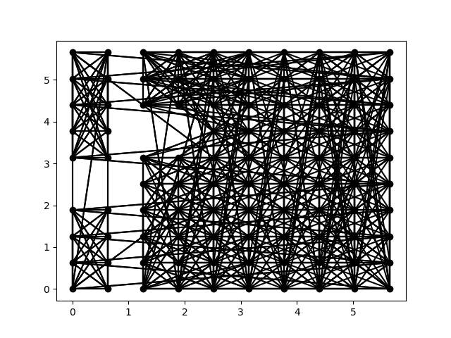
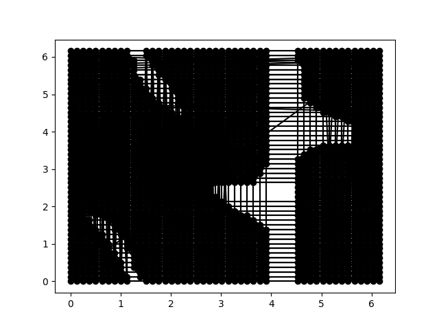
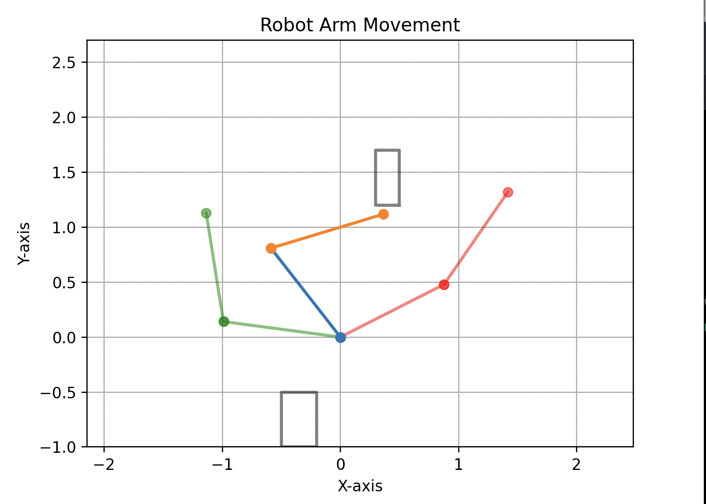
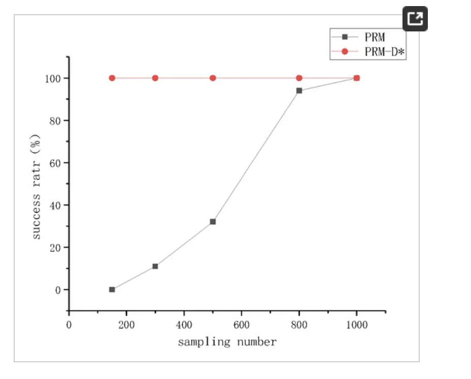

# Robot Motion Planner Report

## Design Overview

This project focuses on the development of a robot motion planner using a Probabilistic Roadmap (PRM) approach. The PRM algorithm systematically constructs a roadmap of feasible configurations, facilitating efficient pathfinding for a robot within a given workspace.

The core of this motion planner is encapsulated in the PRM class. It leverages principles of sampling-based planning, generating a dense set of robot configurations to construct a graph representation of the environment. The class interfaces with the `Robot` class, which is responsible for handling kinematics and collision detection. 

The main steps of the PRM strategy are as follows:

1. **Initialization**: The class is instantiated with parameters such as the resolution of the PRM, connectivity (k), the number of dimensions of the robot arm, and a representation of obstacles. The problem is initialized by the user entirely using this class. 

2. **Sampling**: The next step involves generating a set of uniform dense samples across the configuration space of the robot, which is the set of all possible angle combinations. The density of this sample is determined by the user. 

3. **Graph Construction**: The generated samples are then used to build an adjacency list, representing connections between feasible configurations, that is, configurations that can be reached by one another without making contact with an obstacle. The algorithm carefully considers collision checking to ensure that edges in the graph correspond to viable paths.

4. **Path Validation**: A critical aspect of the planner is the ability to validate paths between two configurations. This involves dividing the path into smaller steps and checking for collisions at each step. This is called a local planner, and I used linear interpolation to generate the intermediate steps.

5. **Pathfinding**: The PRM class takes queries from users, finding paths between specified start and goal configurations. If the start and goal configurations already exist as notes in the graph, the algorithm simply performs a graph search to find the shortest path. If the start and goal configurations are not in the graph, the algorithm first checks if they are feasible. If they are, the algorithm adds them to the graph and performs a graph search.  

## Implementation Overview: 

Ultimately, this project serves as a search problem, where the nodes are robot configurations and the edges are paths between configurations. I didn't want to store entire `Robot` objects for the sake of memory and runtime in the search, so I store the configurations as tuples of angles in the search class. Thus, the `Robot` class is only really used at times throughout the search when it is necessary to check for collisions, interpolate between configurations, or draw the configuration of the robot in physical space. The `PRM` class stores the brunt of the program, including the graph, the sampling, and the pathfinding, relying on the `Robot` class's methods for some calculations. 


## The Robot Class

The `Robot` class is responsible for storing information about the robot, including the number of dimensions, the length of each link, and the location of each joint. I made this class as minimal as possible, only storing necessary information about the robot, and only implementing methods that are necessary for the PRM class.

The methods are as follows: 

- **`__init__(self, angles, link_lengths)`**: Constructor to initialize a Robot object with specified joint angles and link lengths. This automatically calculates the corresponding points to represent the robot arm, because I only initialize robot objects when these points are needed for use. 

- **`__str__(self)`**: Returns a string representation of the Robot object, including its joint angles, which was used for debugging purposes. 

- **`get_points(self)`**: Calculates and returns a list of points representing the robot arm based on the joint angles and link lengths. Used to initialize the instance variable `points` in the constructor, as well as for post-query visualization. 
Psuedo: 

- **`draw_robot_arm(self, obstacles)`**: Draws the robot arm configuration, including obstacles if provided, using Matplotlib. Obstacles are drawn in red, and the robot arm links are represented by colored lines with markers. This is used for visualization purposes and debugging. 

- **`check_collision(self, obstacles)`**: Checks for collisions between the robot arm and a list of obstacles. Returns `True` if a collision is detected, and `False` otherwise. This uses the shapely polygon library to check for collisions between the robot arm and each obstacle.

### Implementation Details: 

Below are more detailed descriptions of the implementation strategies used for `get_points` and `check_collision`, which are important for the logic of the PRM class.

- **`def get_points(self)`**: This function follows a sequential approach, iterating through each link of the robot arm to accumulate the endpoint positions. The algorithm employs basic trigonometry to calculate the x and y coordinates of each joint, considering the cumulative angles of the previous links. Psuedo: 
```
1. Initialize an empty list `points` to store the Cartesian coordinates of each joint.
2. Set initial coordinates `x` and `y` to 0 and add the starting point `(x, y)` to the list.
3. Iterate through each link in the robot arm:
    a. Retrieve the length of the current link.
    b. Calculate the cumulative angle by summing the joint angles up to the current link.
    c. Compute the x and y coordinates of the endpoint using trigonometric functions.
    d. Append the calculated endpoint `(x_end, y_end)` to the `points` list.
    e. Update the values of `x` and `y` for the next iteration.
4. Return the list of Cartesian coordinates representing the robot arm configuration.
```
- **`def check_collision(self, obstacles)`**: This collision checking method employs a nested loop structure to iterate through each link of the robot arm and then through each provided obstacle. The algorithm assesses collision by checking if either the start or end point of a given link lies inside an obstacle or if the line segment connecting these points intersects with the obstacle's geometry. If a collision is detected at any point, the function immediately returns `True`. If no collisions are found after iterating through all links and obstacles, the function returns `False`. Pseudo code:

```markdown
1. For each link in the robot arm:
    a. Retrieve the start and end points of that link.
    b. For each obstacle:
        i. Check if the start or end point is inside the obstacle.
            - If true, return True (collision detected).
        ii. Check if the obstacle intersects with the line between the start and end points.
            - If true, return True (collision detected).
2. If no collision is detected after iterating through all links and obstacles, return False.
``` 

This collision detection approach ensures a comprehensive evaluation of potential collisions between the robot arm and obstacles in the environment.

## The PRM Class

The `PRM` class handles the main calculations and logic of the motion planner. The user can define the robot arm's parameters (the number of links and link lengths) upon initialization, which will be stored and used to construct the search. This class is responsible for generating samples, constructing the graph, and performing pathfinding. The approach entails two main steps: the preprocessing phase and the query phase. 

1. **Pre-Processing**: The preprocessing phase involves generating a set of samples and constructing a graph representation of the environment. This is done by taking a uniform dense sample of the robot's configuration space and constructing graph to represent the connections between different configurations. 

2. **Querying**: The querying phase takes input start and goal configurations from the user and finds a path between them. If the start and goal configurations are not in the graph, they are added to the graph and a path is found. If the start and goal configurations are already in the graph, a path is found without adding any new nodes.

In order to achieve this, the `PRM` class implements the following instance variables: 
```python
    self.samples_per_dimension = samples_per_dimension # resolution of the PRM
    self.num_neighbors = num_neighbors # connectivity of the PRM (k)
    self.obstacles = obstacles # array of obstacles in the environment (shapely polygons)
    self.num_dimensions = num_dimensions # number of arm links
    self.samples = [] # list of samples
    self.adjacency_list = {} # graph represented as an adjacency list
    self.visited_from = {} # dictionary to keep track of which node a node was visited from
    self.step_size = 0.05 # step size for collision checking along the path
```

Methods are described below, organized by logical function.

## Pre-Processing Implementation:  

The first step of the PRM algorithm is to generate the set of uniform dense samples over the robot's configuration space. Because the number of samples taken is the number of samples taken per dimension to the power of the number of dimensions, the number of samples grows exponentially with the number of dimensions. For example, a 2D arm with 10 samples per dimension will result in `10 * 10` samples, whereas a 4D arm with 10 samples for dimension will result in `10*10*10*10` samples. Since the total number of samples taken could vary heavily based on the number of dimensions and the user's goals, I made this a parameter for the `PRM` class so the user can specify the resolution of the PRM. 

**Sample Collection: `def uniform_dense_sample(self)`**

The `uniform_dense_sample` function is designed to generate a set of uniform and dense samples across the configuration space of the robot. This function initiates the process by printing a message to indicate the commencement of sample generation. It then invokes a recursive helper function, `uniform_dense_sample_recursive`, to systematically explore and collect samples within the specified dimensions. The function utilizes a recursive approach to traverse the configuration space systematically. Starting with an empty list, `current_sample`, the algorithm iterates through each dimension of the configuration space, dividing it into a specified number of samples per dimension. For each sampled value, a copy of the current sample is created, and the next value is appended. This process continues recursively until samples are generated for all dimensions, and each set of values forms a valid configuration for the robot. The generated samples are stored in the `self.samples` list.

`uniform_dense_sample` Pseudocode:
```markdown
1. Print a message indicating the initiation of sample generation.
2. Initialize an empty list `current_sample`.
3. Invoke the recursive helper function `uniform_dense_sample_recursive` with the empty `current_sample`.
   - This function will handle the recursive generation of samples.
```
`uniform_dense_sample_recursive` Pseudocode:

```markdown
1. Base case: If the length of `current_sample` is equal to `self.num_dimensions`, then all dimensions have been assigned.
   - Append the current sample to the list of samples (`self.samples`).
   - Return from the recursive call.
2. Otherwise, for each value in the range of `self.samples_per_dimension`:
   a. Make a copy of the current sample.
   b. Add the next value to the copy based on the current dimension.
   c. Pass the modified copy to the next recursive call.
``` 

**Graph Construction: `def build_graph(self)`**

The build_graph function is responsible for constructing the graph representation of the robot's configuration space using an adjacency list. This process involves iteratively evaluating each sample in the list, checking for collisions with obstacles, and establishing valid connections (edges) between samples. The resulting graph, stored as an adjacency list, captures the connectivity of the configuration space. 

The function iterates through each sample in the list, creating a temporary robot configuration for collision checking (this saves memory as opposed to maintaining a robot list). If the sample is collision-free, it is added to the adjacency list. Then, the remaining samples (excluding the current sample) are ordered by distance, and added as neighbors to the current sample. The number of neighbors added is determined by the `self.num_neighbors` parameter. 

**Pseudocode:**

```markdown
1. For each sample in the list of samples:
    a. Create a temporary robot configuration based on the current sample.
    b. Check if the robot configuration is collision-free with obstacles.
        - If collision-free:
            i. Add the sample to the adjacency list with an empty list of neighbors.
            ii. Initialize a counter `k` for tracking the number of neighbors.
            iii. For each other sample sorted by distance:
                - Check if the edge between the current sample and the other sample is valid.
                - If valid, add the other sample to the adjacency list as a neighbor.
                - Increment the counter `k`.
                - Break the loop if the desired number of neighbors (`self.num_neighbors`) is reached.
```

**Distance Calculation: def get_sample_distances(self, sample) and get_distance(sample1, sample2)**

In order to do this, I separated the logic for ordering the samples by distance from a given sample, as well as determining whether an edge between two samples is valid, into separate functions. This allows for easier testing and debugging of the graph construction process.

To sort the samples by distance, I first wrote the function `get_distance` to retrieve the euclidian distance between the configurations of two samples. This function takes two samples as input, and returns the euclidian distance between them. This function is used by `get_sample_distances` as a helper, allowing it to retrieve the distance between a given sample and all other samples, ordering them by distance for use by the graph construction function. 

The `get_distance` function works by iterating through each dimension of the configuration space, retrieving the difference between the values of the two samples, squaring the difference, and adding it to a running sum. The square root of the sum is returned as the euclidian distance between the two samples. 

**Note**: As the assignment mentioned, the distance between two angles is not simply the difference between the two angles. Instead, the distance between two angles is the absolute value of the difference between the two angles, unless the absolute value of the difference is greater than or equal to pi. In this case, the distance is the difference between 2 * pi and the absolute value of the difference between the two angles. This is because the distance between 0 and 2 * pi is 0, not 2 * pi.

Pseudo: 
```
def get_distance(sample1, sample2):
1. Initialize the distance to 0.
2. For each dimension in the samples:
    a. Calculate the absolute difference between the corresponding values in sample1 and sample2.
    b. If the absolute difference is less than pi:
        - Add the squared difference to the distance.
    c. If the absolute difference is greater than or equal to pi:
        - Add the squared difference considering the periodicity of angles (2 * pi - |sample1[i] - sample2[i]|) to the distance.
3. Return the square root of the accumulated distance.
```

`def get_sample_distances(self)` just uses this function to create a dictionary associating distances with each of the samples (except for the sample itself, of course). I then just use the python `sorted` function to sort the samples by distance, returning that list. Then, the graph builder just begins iterating through it, so the samples will automatically be in order. 
Psuedo: 
```
def get_sample_distances(self, sample): 
1. Initialize an empty dictionary of samples and distances
2. For each other sample in `self.samples`
    a. set the dictionary value for that sample to `get_distance`(sample, other_sample)
3. Sort the dictionary and return it
```

**Edge Validation/Local Planning: `def validate_path(self, sample1, sample2)`**

A local planner is necessary to construct the graph, because it allows us to determine which edges between vertices are valid. In this case, even though the two vertices are valid configurations, the edge between them may not be valid, since the arm may have to pass through an obstacle to reach one from the other. 

To determine this, we check the validity of the arm configuration at step intervals between the two points in the configuration space (in the graph). If the arm is ever in collision, the edge is invalid. Otherwise, it is valid.

By using tiny step intervals, we can pretty much guarantee that the the edge is valid, since the arm could only be in collision for a minisculte amount of time. However, this comes at the cost of computation time, since we have to check the validity of the arm at many different configurations throughout the graph build. 

Again, I decided to make this a parameter in the PRM constructor (`self.step_size`), so that it can be easily changed. This allows the user to increase the resolution at the cost of computation time or decrease it to save time, according to their preferences. The algorithm then runs as follows: 

```
1. Initialize the path validity flag to True.
2. Create a robot object with the configuration of sample1.
3. Calculate the Euclidean distance between sample1 and sample2 using the `get_distance` function.
4. Determine the number of steps to take along the path based on the distance and the specified step size.
    a. If the number of steps is 0, set it to 1 to ensure at least one step is taken.
5. For each step along the path:
    a. Initialize an empty list `interpolated_sample`.
    b. Interpolate each dimension of the sample between sample1 and sample2.
    c. Set the robot configuration to the interpolated sample.
    d. Check if the interpolated sample is in collision with obstacles using the robot's `check_collision` method.
    e. If collision is detected:
        - Set the path validity flag to False.
        - Break the loop.
6. Return the final path validity flag.
```

## Querying Implementation: 

After the `uniform_dense_sample` and `build_graph` functions have been executed, the `PRM` instance variable `self.adjacency_list` contains the graph representation of the robot's configuration space. This graph can then be queried to find a path between two points in the configuration space.

The process of the querier is as follows: 

1. If the start or goal configurations are in collision with obstacles, return an empty path.
2. If the start or goal configurations are not already in the graph, find their nearest neighbors in the graph and add them to the graph.
3. Find the shortest path between the start and goal configurations using a search algorithm.
4. Return the path.

To do this, the user can call the `query(self, start, goal)` function of the `PRM` class. This function takes two configurations as input, and returns a list of configurations representing the path between the two configurations, or `None` if no path is found. 

I've split this logic into several functions that made it easier to test and debug. 

**Verifying states and modifying the graph: def_query(self, start, goal):**

The main query function that handles the user's query encapsulates the logic for the start and end configuration verification, as well as graph modification. This function then calls the `find_path` function to find the path between the two configurations.

Pseudo: 
```
def query(self, start, goal):
1. If the start or goal configurations are in collision with obstacles, return an empty path.
2. If the start or goal configurations are not already in the graph, connect them to the graph using `def connect_node_to_graph(self, node)`. 
3. return `self.find_path(start, goal)`
```
This function is pretty simple, serving as a wrapper for the other functions, described below. 

**Connecting the start or goal node to the graph: `def connect_node_to_graph(self, node)`:**

This function is called by the `query` function to connect the start or goal configuration to the graph. It does this by finding the nearest neighbor of the configuration in the graph, and adding an edge between the two. 
Pseudo: 
```
def connect_node_to_graph(self, node):
1. add the node to the `self.samples` list
2. Initialize it's adacency list to an empty list in the graph
3. for each other node ordered by nearest distance
    a. if the node isn't the node we are trying to add and there is a valid path between the two nodes:
        - add an edge between the two nodes
        - break the loop
```

**Finding the Path: `def find_path(self, start, goal)`**

Because the search spaces are relatively small here, I decided to use a simple breadth-first search to find the path between the start and goal configurations. This was adapted from the foxes and chickens lab, but without the search solution object. It also uses the same backchain function as before, which I won't describe in detail here. 

## Method Testing 

I tested the majority of these methods in isolation, piece by piece so that no further errors would arise. Below I briefly describe each of the methods and how I tested them. 

- **robot.get_points()**: I tested this by creating a robot object with a known configuration, and then checking that the points returned by the function were correct. I also wrote the function draw_robot arm to visualize the robot, and used that to verify that the points were correct. This was not too difficult. 

- **robot.check_collision()**: I tested this by creating a robot object and obstacles with known configurations. Then, I used the `robot.draw_robot_arm` function to visualize the robot and obstacles, printing whether or not a collision was detected to the console and verifying with the visualization. 

- **PRM.uniform_dense_sample()**: I tested this by creating a few less-complex robot arm problems, using print statements to investigate the samples and the sizes. I verified that the angle intervals were being calculated correctly, and that the number of samples was correct. 

- **PRM.get_distance()**: I tested this by creating a few less-complex robot arm problems, using print statements to investigate the distances. I verified that the distances were being calculated correctly, which they were. 

- **PRM.get_sample_distances() and PRM.get_distance()**: I again tested this with a few less-complex robot arm problems, using print statements to investigate the samples that were being calculated as neighbors. The algorithm here is very simple, so it was pretty easy to see that the list was indeed ordered correctly by distance. 

- **PRM.validate_path()**: I tested this algorithm separately fromt the rest of the program in order to truly verify its funcitonality. I did this by just passing it two robot configurations that I constructed, with an obstacle between or with the start or end configuration having an obstacle.   

- **PRM.build_graph()**: I tested this by creating a few less-complex robot arm problems, using print statements to investigate the graph that was being built. I verified that the adjacency list had the correct number of neighbors, and that the neighbors were indeed the closest neighbors. 

I then made the function `def graph(self, path=None)` to visualize the adjacency list. I did this with multiple different problems of different sample resolutions, and different connectivity parameters. I could see the outline of the obstacles easily in the configuration space. 

Low Resolution:


High Resolution (these are different obstacles of course):


- **PRM.connect_node_to_graph()**: To test this, I used print statements on smaller graphs to verify that the node was being added to the graph, and that the correct nearest neighbor was being found. I did this at multiple steps throughout the program. 

- **PRM.find_path()**: I tested this using the same method `def graph(self, path=None)` to visualize the adjacency list, with the path found by the search algorithm in red. The paths were indeed shortest paths, and followed existing edges and vertices in the graph. 

## Extra Credit Animation Testing:

I used this system a lot to test the different configurations and make them work. 2D configurations are by far the easiest to test since you can choose a start and end in the configuration space that will work well with the obstacles. I did this with a few different sets of polygons, which you can find in the main method of the `PRM` class. Below is an explanation of the original implementation and the animation upgrades. 

Although the animation sometimes does go over an obstacle, this is because the sampling resolution is too low, and the robot arm is not able to move around the obstacle. This is not a problem with the algorithm, but rather a problem with the sampling resolution. If this happens in testing, increase it. 

Originally, I had just viewed the graph using the `def graph(self, path=None)` function, but I decided to make an animation of the robot moving along the path. I did this by creating a function `def animate_path(self, path)` that takes a path as input, and then iterates through the path, drawing the robot at each configuration. I then used the `matplotlib.animation` library to animate the robot moving along the path.

I originally did this by using the matplotlib animation feature, and I wrote the function `def animate_robot_movement` to view each step in the path sequentially, ensuring that the arm could manouver its way through obstacles. These obstacle sets are hard coded into the main function of `PRM.py`, and you can use them to test the PRM. 

On top of this, I also implemented a few advancements that smooth the path, while, also allowing the user to see which vertex points were met along the way. This was a little annoying to do, when adapting for the number of dimensions and the different step start and end positions and therefore step sizes. I did this by iterating through each of the points in the path and finding the distance in the configuration space between that point and the next point in the path. 

I then divide this difference into small amounts, incrementally adding it to each of the values for the given configuration to add a bunch of small steps in between each of the path points. This smoothes the path, making the animation appear very fluid. 

This implementation turned out to be surprsingly difficult, due do handling the cases where the arm goes past a full rotation. Crossing this threshold caused a lot of sign errors, and therefore a lot of jumping around in the animation. Here's how I did it:

The main logic for the animation is in `def animate_robot_movement(self, path)`, below. First, I have to iterate through all of the path points to make sure that the graph axes are set appropriately to display all of the configurations along the path to the solution. Then, we create a new list to store the smoothed path. To fill this list, we iterate through the points in the path, find the difference between each consecutive pair, divide that difference into small steps, and then add those steps to the smoothed path in between the two points, giving it a smooth animation effect. 

Below is the code I wrote for this implementation: 
```Python
def animate_robot_movement(self, path):
        fig, ax = plt.subplots()
        smoothed_path = []

        # get each robot's points and save them 
        xmax, ymax = 0, 0
        xmin, ymin = 0, 0
        
        # save axis limits
        for i in range(len(path)):
            robot = Robot(path[i], [1] * self.num_dimensions)
            points = robot.get_points()
            for point in points:
                if point[0] > xmax:
                    xmax = point[0]
                if point[1] > ymax:
                    ymax = point[1]
                if point[0] < xmin:
                    xmin = point[0]
                if point[1] < ymin:
                    ymin = point[1]
        
        smoothed_path.append(path[0])  # add the initial point

        # for each point in the path
        for i in range(len(path) - 1):
            dif = []
            # get the absolute differences between the current and the next point
            for j in range(self.num_dimensions):
                difference = (path[i+1][j] - path[i][j])
                if abs(difference) > np.pi: 
                    if difference > 0:
                        difference = -(2 * np.pi - abs(difference))
                    else:
                        difference = (2 * np.pi - abs(difference))
                dif.append(difference)
            print(dif) 

            # get the number of steps to take
            num_steps = 10
    
            # for each step
            for j in range(int(num_steps)):  # start from 1 to avoid adding duplicate points
                # get the interpolated sample
                interpolated_sample = []
                for k in range(self.num_dimensions):
                    # interpolate each dimension using a consistent step size
                    interpolated_sample.append(path[i][k] + (dif[k] / num_steps * j))
                smoothed_path.append(interpolated_sample)

        # add the final point
        smoothed_path.append(path[-1])


```
After this smooothed path is created, we draw it in matplotlib. This is stored in the `update` function, which is pretty long and boring, so I won't include it here. Its funciton is to draw the start and end locations in light green and red, draw the obstacles, and then draw the robot in its current location in each step. The result looks pretty good-- to run it, just run `PRM.py`. 

Here's a screenshot in progress: (open the report.md in preview mode in your editor to see this image. Alternatively, just look in the screenshots folder). 




## Extra Credit- Literature Review: 

Study on an improved method for path planning of robot manipulators based on PRM [here](https://www.mdpi.com/1424-8220/23/7/3512).

This study investigated the use of an improved PRM algorithm to find a path for a robot manipulator. The method was used for mobile rboots that need a high success rate, fast planning, a shortest path, and good dynamic obstacle avoidance. Although the k-PRM we implemented in this project does a good job at finding a shortest path, has fast planning, and a high success rate, it does not do a good job at dynamic obstacle avoidance. This study investigated the use of a new method to improve the PRM algorithm to better handle dynamic obstacles using the D* algorithm, which is a dynamic path planning algorithm. 

I didnt' get too deep in the workings of the D* algorithm, but I learned that this ultimately allows the planner to avoid excessive sampling in the configuration space, improving efficiency. This is because the algorithm allows the planner to avoid small obstacles in real time, reducing the need for higher sampling resolutions. 

I noticed this in my project-- a pretty high sampling resolution was needed to actually avoid all of the obstacles in the physical space, becuase even with interpolation, it was pretty easy to end up with edges that skipped an invalid configuration. 

The study then tested the performance of the mobile robot in a maze using the different sampling points. The results showed that the improved PRM algorithm was able to find a path in a shorter time, and with a higher success rate, however, this advantage decreases as the number of samples increases. Thus, at a higher number of samples, the two algorithms are the same. However, the PRM-D* algorithm allowed for a much lower amount of samples to maintain the same success rate, improving efficiency. 



## Extra Credit- Nearest Neighbors: 

When building the graph in the PRM, we need to find the nearest neighbors to each vertex. This is done by finding the euclidean distance between each vertex and each other vertex, and then finding the k nearest neighbors. This is done in the `def get_sample_distances(self)` function, as described above. 

In the original implementation, I just use the list of all the samples to construct a dictionary that associates the sample with its distance to each other sample. Then, I use the Python `sorted()` method to return the list of these keys (which are samples in the configuration space), ordered by their distance to the given sample. This is pretty fast- the python sampling method is pretty good, and under this implementation, I was able to run a few thousand samples on the configuration space in just a few seconds. 

However, I did use scikit-learn's nearest-neighbors method, which allegedly allows for much faster retrieval of these neighbors. I did this in the `def get_nearest_neighbors` function instead of the `get_sample_distances` function, which allowed me to separate the logic. I made it work after some debugging, but this implementation ultimately was much slower than my original. Here's how I did it: 

```Python
    def get_nearest_neighbors(self, sample):
        samples_array = np.array(self.samples)

        # Create a NearestNeighbors object (using the library)
        nn = NearestNeighbors(n_neighbors=len(self.samples), algorithm='auto', metric='euclidean')
        nn.fit(samples_array)

        # Find the indices of the nearest neighbors and their distances
        indices = nn.kneighbors(samples_array)

        # Convert the indices and distances to lists
        sorted_keys = indices[0].tolist()

        # Remove the index of the sample itself (if it's in the list)
        if sample in self.samples:
            sample_index = self.samples.index(sample)
            if sample_index in sorted_keys:
                sorted_keys.remove(sample_index)

        return sorted_keys
```

I suspect that it is a lot slower because it works with numpy arrays rather than a list. Therefore, at each call to the function, I have to convert the entire list of samples to a numpy array, and then convert the indices back to a list. This is a lot of overhead, and I suspect that this is why it is slower.
